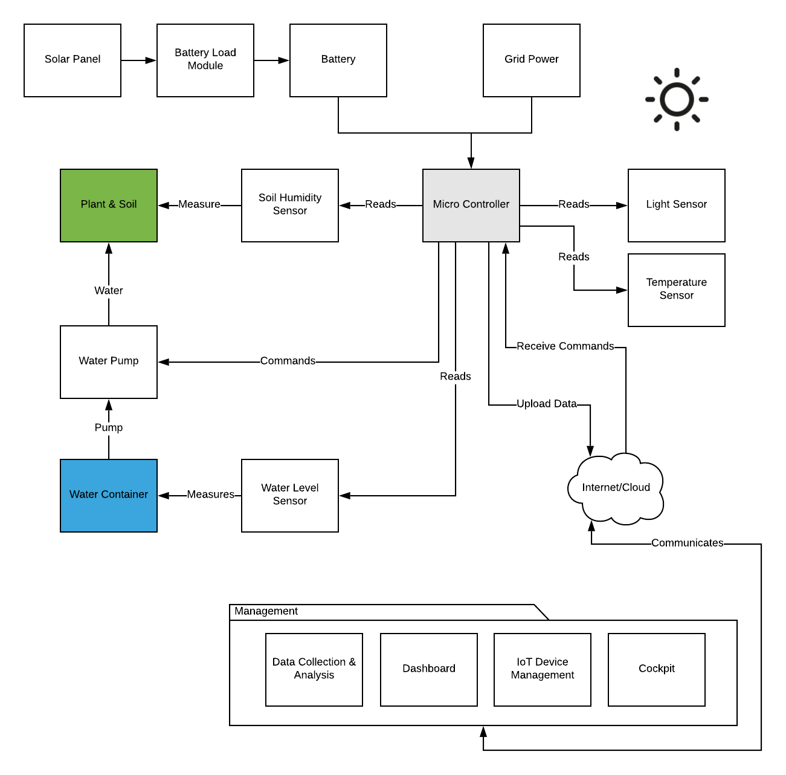

# SPA - Smart Plant (Watering) Assistant

Automatic watering of plants based on various smart decisions - time, soil humidity, forecast and more.

## Current Status
Planning v0.1

## Introduction
Ever thought about leaving home for a week and not thinking about how to water your plants? And what if you do not own a green thumb? **SPA**, short for **S**mart **P**lant **A**ssistant, may help you out - by providing real time information about your plants, automatic and manual watering possibilities.
The system is build with modules, so you could use only the informational dashboard and notifications module and be reminded if your plants are in need of fresh water.

## Features for v0.1
*  Start/Stop Water Pump
*  Read Soil Humidity 
*  Read Temperature
*  Read Light Level
*  Read Water Level
*  Manual Water Irrigation
*  Web Dashboard
*  Web Cockpit

## Features for v0.2
*  Notifications
*  Reminders (Time or sensor based)

## Smart Decision Features for v0.x
*  Time Based Water Irrigation
*  Sensor Based Irrigation
*  Use Forecast Data
*  Machine Learning

## Extensibility Features
*  Solar Powered Modules
*  API

## Possible System Architecture

